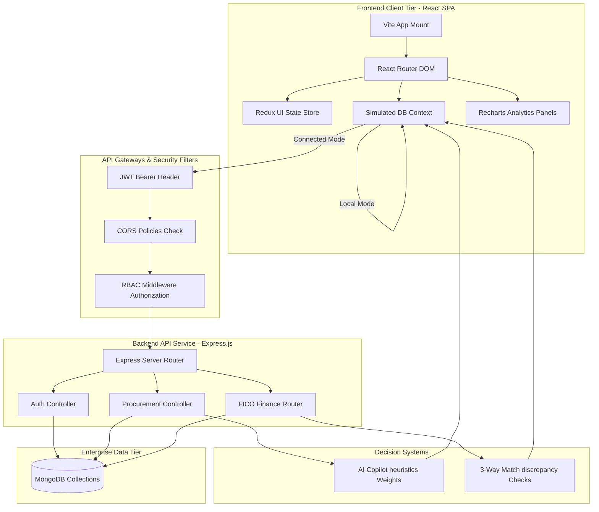

# ProcureFlow S/4: Intelligent Procurement. Smarter Decisions.

ProcureFlow S/4 is a production-grade enterprise procurement and vendor management platform inspired by **SAP S/4HANA (MM & FICO)**, **SAP Ariba**, **Coupa**, **Stripe**, and **Linear**. It digitizes and automates the complete Procure-to-Pay (P2P) lifecycle with visual dashboards, 3-way matching audits, FICO payment scheduling, and an AI-powered Copilot.

---

## 🏗️ System Architecture Diagram

Below is the technical data flow, component layout, and security routing matrix.



---

## 📁 Repository Directory Structure

```
sap/
├── frontend/                     # React Vite Client (SPA)
│   ├── src/
│   │   ├── components/           # CommandPalette.jsx, charts, search
│   │   ├── context/              # SimulatedDBContext.jsx (Browser DB engine)
│   │   ├── layouts/              # MainLayout, Sidebar, Navbar, NotificationDrawer
│   │   ├── pages/                # Modules (Dashboard, ProcessFlow, Materials, Vendors, etc.)
│   │   │   └── auth/             # Login, Register, ForgotPassword, ResetPassword
│   │   ├── mock/                 # defaultMockData.js (Enterprise starting dataset)
│   │   ├── store/                # Redux Toolkit config & uiSlice
│   │   ├── App.jsx               # Routes setup & Route Guards
│   │   ├── main.jsx              # React mounting root
│   │   └── index.css             # Tailwind v4 import & custom theme styles
│   └── package.json
│
└── backend/                      # Node Express REST API Server
    ├── config/                   # db.js (MongoDB config)
    ├── middleware/               # auth.js (RBAC & protect verification)
    ├── models/                   # Mongoose schemas (User, Material, Vendor, RFQ, PO, etc.)
    ├── routes/                   # authRoutes.js & apiRoutes.js
    ├── scripts/                  # seeder.js (Prepopulating starting accounts)
    ├── server.js                 # Entrypoint listener
    └── package.json
```

---

## 🔐 Sample Demo Accounts (Role-Based Access)

To demonstrate and test various workflows across the platform, use these pre-seeded accounts. The app has a role switcher in the navbar, allowing you to instantly switch roles for demo walkthroughs.

| Role | Email | Password | Allowed Scope |
| :--- | :--- | :--- | :--- |
| **System Admin** | `admin@procureflow.com` | `admin123` | Master control, system configurations, and setup. |
| **Procurement Manager** | `manager@procureflow.com` | `manager123` | Releases Purchase Orders (PO), approves Requisitions (PR), Quotation comparisons. |
| **Purchase Officer** | `officer@procureflow.com` | `officer123` | Submits Requisitions (PR), dispatches RFQs, reviews supplier quotations. |
| **Warehouse Manager** | `warehouse@procureflow.com` | `warehouse123` | Performs Goods Receipt Note (GRN) inspections and storage bin allocations. |
| **Finance Manager** | `finance@procureflow.com` | `finance123` | Performs SAP 3-Way Match invoice audit verification and releases payments. |
| **Vendor Representative**| `vendor@procureflow.com` | `vendor123` | Logs bids (price and lead times) in response to active buyer RFQs. |

---

## 🛠️ Step-by-Step Setup Instructions

The application supports two configuration routing modes:
1. **Local Demo Mode (Default)**: Uses the browser's persistent `localStorage` to mock server behaviors, allowing immediate, full-featured review without database installations.
2. **Connected API Mode**: Connects to the Express backend and MongoDB database.

### Running in Local Demo Mode
1. Navigate to the `frontend/` directory and install dependencies:
   ```powershell
   cd frontend
   npm install
   ```
2. Launch the Vite development server:
   ```powershell
   npm run dev
   ```
3. Open the browser to the address printed in terminal (typically `http://localhost:5173`).

### Running in Connected API Mode
1. Ensure **MongoDB** is running locally on your system.
2. Navigate to the `backend/` directory and install dependencies:
   ```powershell
   cd backend
   npm install
   ```
3. Seed the MongoDB database with default Materials, Vendors, and Role Users:
   ```powershell
   node scripts/seeder.js
   ```
4. Start the Express server on port 5000:
   ```powershell
   node server.js
   ```
5. Navigate to the `frontend/` directory, install packages and start the Vite app as described in the Local Demo section.
6. Once the app opens, toggle **Live Server** in the navbar to route transactions to the Node API.

---

## 📖 Complete P2P Demo Walkthrough Guide

To showcase the platform's enterprise workflows, follow this typical Procure-to-Pay (P2P) sequence:

1. **Submit Purchase Requisition (PR)**:
   - Log in as the **Purchase Officer** (`officer@procureflow.com`).
   - Navigate to **Purchase Requisitions** and click **Create PR**. Pick a material (e.g. `MAT-1003 - Industrial Gas Valves`), input a quantity, and click submit. The PR status changes to `Submitted`.
2. **Approve Requisition**:
   - Switch role to the **Procurement Manager** (`manager@procureflow.com`) using the role switcher on the navbar.
   - You will see the pending PR on your Dashboard. Select **Approve Requisition**.
3. **Dispatch RFQ to Suppliers**:
   - Switch role back to **Purchase Officer**.
   - Navigate to **RFQ Management** and click **Create RFQ**. Choose the approved PR reference, check the boxes for multiple vendors (Apex Supplies, Global Tech, Matrix Metals), set a deadline date, and click **Create**. This sends invitations to bid.
4. **Log Bids (Vendor Perspective)**:
   - Switch role to the **Vendor** (`vendor@procureflow.com`).
   - Navigate to **RFQ Management**. You will see the open RFQ. Click **Submit Bidding Quote**, enter a unit price and shipping lead time, and click submit.
5. **Analyze Quotations & Select Winner**:
   - Switch role to **Procurement Manager**.
   - Navigate to **Quotation Comparison**. Select your RFQ.
   - Click **Run AI Recommendation**. The engine evaluates pricing margins vs past supplier delivery and quality ratings. It highlights the winning bidder in a glowing purple card explaining its recommendation. Click **Issue PO to Supplier** next to the winner.
6. **Accept Goods (Warehouse Receiving MIGO)**:
   - Switch role to the **Warehouse Manager** (`warehouse@procureflow.com`).
   - Navigate to **Goods Receipt**. You will see the PO listed under pending shipments. Click **Receive Goods**. Inspect items, record any damages, assign a warehouse storage bin (e.g., `SL02`), and click save. This increments current stock on the Material Master.
7. **Perform 3-Way Match Audit (MIRO)**:
   - Switch role to the **Finance Manager** (`finance@procureflow.com`).
   - Navigate to **Invoice Verification**. Select the newly logged invoice.
   - The screen renders the PO, GRN, and Invoice details side-by-side. If there is a price mismatch (e.g. supplier billed a higher rate than the PO agreement), the system flags the invoice as `Blocked`. If everything matches, click **Verify & Release**.
8. **Accounts Payable Payment (FICO)**:
   - Go to **Payments**. You will see the released invoice scheduled for payment.
   - Select **Disburse AP**, choose the payment method (Bank Wire/UPI), and click submit to process the transaction. Review the analytics charts for updated spend metrics!
9. **AI Copilot & Assistant Chat**:
   - Open **AI Copilot**. Review spend anomalies and risk forecasting.
   - Try typing queries in the chat input or click sample questions like:
     - *"Which vendor has best performance?"*
     - *"Which materials need reorder?"*
     - *"Predict next month's spend."*
     The Copilot responds with custom formatted tables and forecasting charts.
